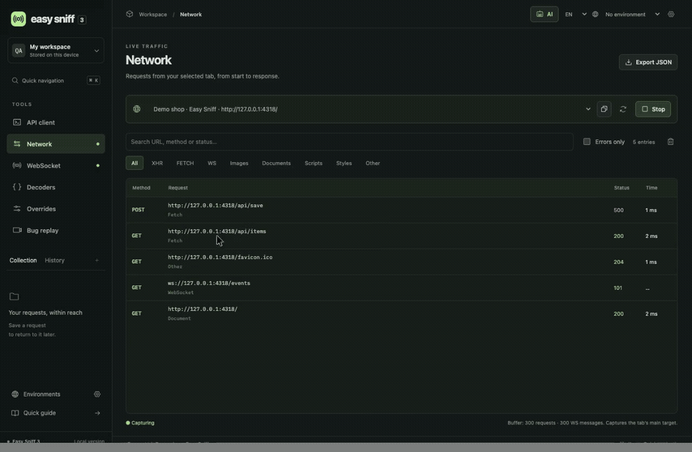
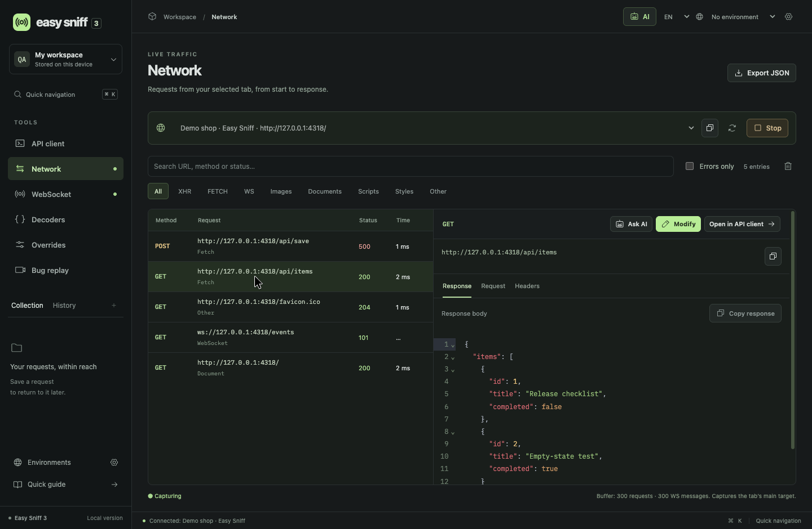
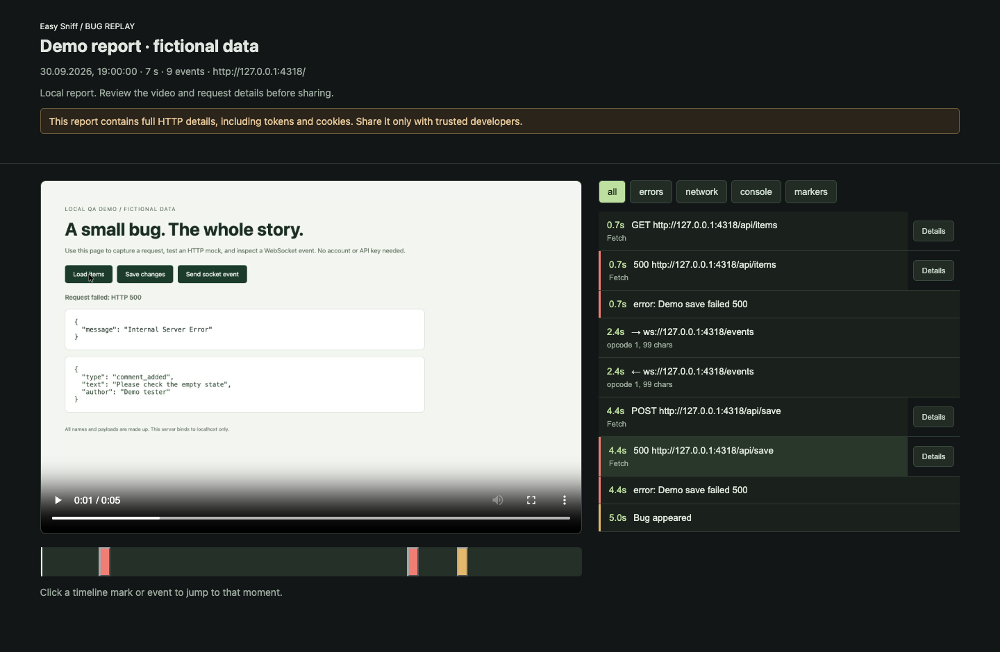
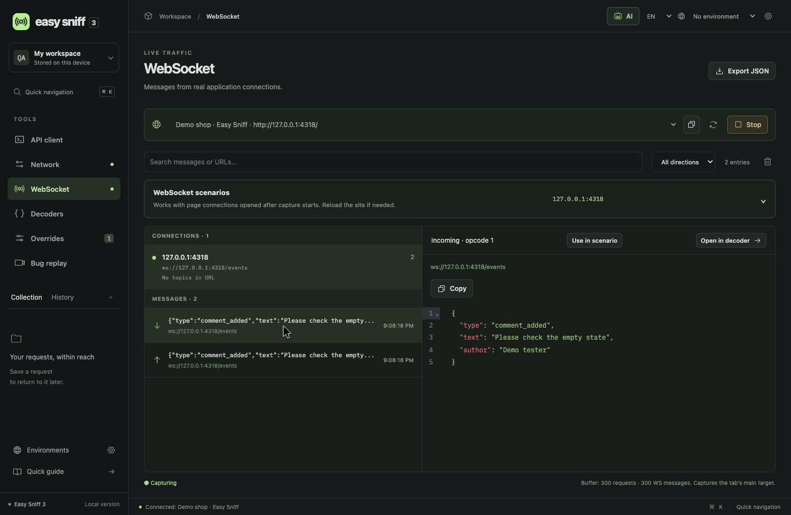

# Easy Sniff 3

**Turn a browser bug into a reproducible API case and a video report with network and console context.**

Easy Sniff is a free, local QA workspace for Chrome: capture requests, simulate failures, test WebSocket events, and hand a developer the evidence in one ZIP. It opens in a separate window and works with your own AI provider.

[Download 3.7.0](https://github.com/solosenkov/easy-sniff-extension/releases/latest) · [Changelog](CHANGELOG.md) · [Report a bug](https://github.com/solosenkov/easy-sniff-extension/issues/new/choose) · [MIT license](LICENSE)

- **Bug Replay:** tab video with a synchronized timeline of HTTP, console, WebSocket metadata, and error markers. Export an offline HTML report.
- **Traffic overrides:** return 500, change JSON, delay or block requests, and modify request headers or payloads.
- **WebSocket scenarios:** send a message, inject a local incoming event, or replace future incoming text frames.
- **AI assistant:** find a captured request, explain a payload, and prepare editable HTTP or WebSocket rules. You apply the changes.
- **QA essentials:** cURL import/export, API client, collections, environments, JSON/JWT/Base64 decoders, and English/Russian UI.



The demo uses a local fictional shop: a request returns 200, an override is enabled, and the next request returns 500. [Watch the short video](assets/demo/http-mock.mp4).

## Quick start — no Node.js required

1. Download **`easy-sniff-v3.7.0.zip`** from [Releases](https://github.com/solosenkov/easy-sniff-extension/releases/latest).
2. Extract it into a permanent folder. `manifest.json` must be directly inside that folder.
3. Open `chrome://extensions` and enable **Developer mode**.
4. Click **Load unpacked** and select the extracted folder.
5. Open your test page and click the Easy Sniff extension icon.

**Requirements:** Chrome 118 or later. Chromium browsers such as Edge and Brave may work when they support the required extension APIs; Chrome is the primary testing target. Firefox and Safari are not supported. Installation is currently via an unpacked extension, not a browser store.

To update, replace the extracted files, click **Reload** on the extension card, close the old Easy Sniff window, and open it again. Keep the installation folder in place.

## Your first test: capture → modify → repeat

1. In **Network**, select your test tab and click **Start recording**. This starts traffic capture. Reload the page or perform the action that calls the API.
2. Filter by **FETCH** or **XHR** and select the request you need. Inspect its response, request, and headers.
3. Click **Modify**, then **Return 500**. Check the URL and method, enable the rule, and save it.
4. Repeat the action in the test page. The application receives your synthetic 500 response, and the new entry appears in Network.
5. Disable the rule to restore normal behavior. **Stop** also ends capture and applying overrides to that tab.

To try this with fictional data, run `node examples/demo-server.mjs` and open `http://127.0.0.1:4318`. **Load items** calls `/api/items`; **Save changes** deliberately returns 500; **Send socket event** sends an echo message. The demo server needs Node.js, but installing Easy Sniff does not.



## Bug Replay: a report the developer can explore

Record the visible bug and its technical context together. A developer can watch the video, filter errors, inspect a request, and click a timeline event to jump to that moment without installing Easy Sniff.

1. On the page you want to record, click the Easy Sniff icon. This grants capture access to that tab.
2. Open **Bug replay** in the tool window and confirm the selected tab.
3. Optionally enable **Full HTTP details**, then click **Start recording**.
4. Reproduce the bug. Click **Bug appeared** to add a QA marker, then **Stop**.
5. Select the saved recording and click **Download ZIP**. Send the reviewed ZIP to the developer.

The developer extracts the ZIP and opens **`report.html`** beside **`video.webm`** and **`session.json`**. Red marks identify HTTP 4xx/5xx, failed requests, console errors, and uncaught exceptions. Yellow marks identify slow requests and QA markers. Click an event to seek the video; use **Details** to inspect full HTTP data when it was recorded.

**Full HTTP details** is off by default. When enabled, it intentionally includes raw URLs, headers, Cookie/Set-Cookie, Authorization values, available bodies, timing, and copyable cURL. Bodies are capped at 1 million characters each and 25 million characters per recording; omissions and truncation are displayed. Old recordings cannot gain data that was never captured.

Recordings stop after five minutes or when the recorded tab closes. They stay locally until deleted. Bug Replay is evidence playback: it does not repeat clicks or rerun the application. The earlier experimental **Time Machine/scenario-pack** feature was removed in 3.6.0; there is no `.easysniff.json` scenario import in the current release.



[Download an example report](https://github.com/solosenkov/easy-sniff-extension/releases/download/v3.7.0/bug-replay-demo.zip), extract it, and open `report.html`. This illustrative report uses a video of the fictional demo shop and a synthetic event dataset. Its JSON is available in [examples/bug-replay-session.json](examples/bug-replay-session.json).

## AI assistant: bring your own model

Open **AI** in the top bar, or select a request and click **Ask AI**. In the connection settings, add an OpenAI-compatible endpoint, OpenRouter, Ollama Cloud, local Ollama, or LM Studio. Enter the API base URL, key if needed, and model ID. Load the model list, select a model that supports tool calling, and use the model check before saving. Multiple connections can be switched locally.

Useful prompts:

- “Find the failed save request and prepare a 500 mock with a small JSON error.”
- “Change every item title in this response to a long Unicode string. Keep the rest of the JSON intact.”
- “Find the latest incoming comment event, decode it, and prepare a modified copy with empty text.”
- “Prepare a request in the API client from this captured call.”

The assistant can search captured HTTP and WS data, read and decode payloads, and prepare API requests, environments, disabled override rules, WS injection/replacement drafts, capture controls, and JSON exports. **Proposals require your action**; AI does not silently send a request or enable a rule. It cannot execute arbitrary page JavaScript or shell commands.

Choose the context scope: no traffic, the selected request, or captured traffic. The initial overview previews up to 40 recent non-WS requests, while tool searches use the entire current capture buffer and refresh it during a model turn. **Ask AI** pins a selected request when you already know the target.

Model timeout is configurable from 30 to 900 seconds (default 600); output limit is configurable from 512 to 32,768 tokens. These settings control a response, not the model's full context window. Provider costs, quotas, availability, and tool support depend on the model you choose.

## WebSocket scenarios

Capture before the socket opens, then reload the test page. Select a connection and a frame. **Use in scenario** prepares an editable payload; **Open in decoder** helps inspect encoded or compressed messages.

| Scenario | What it does                                                       | Useful for                                                      |
| -------- | ------------------------------------------------------------------ | --------------------------------------------------------------- |
| Send     | Sends a text message through the page's open socket to the server. | Testing server validation or a subscription command.            |
| Inject   | Delivers a synthetic incoming message to the application locally.  | Testing a notification, an empty field, or an unexpected event. |
| Replace  | Saves a rule that changes matching future incoming text messages.  | Testing how the UI handles modified server events.              |

Injection and replacement affect the app locally. The network journal keeps the original server frames. A message already received cannot be changed retroactively. Exact-match rules can stop matching when an ID or timestamp changes, and encoded protocols need the same payload format.



## More tools and testing scenarios

| Tool            | Use it to                                                                                                                                         |
| --------------- | ------------------------------------------------------------------------------------------------------------------------------------------------- |
| API client      | Import a copied cURL, edit method/URL/query/headers/body/Bearer auth, send it again, inspect the response, and save it to a collection.           |
| Environments    | Switch base URLs and variables across local or test environments.                                                                                 |
| Network filters | Keep XHR/Fetch or WS visible and filter out images, styles, scripts, and documents. Search URLs, methods, and status codes.                       |
| Overrides       | Test error states, loaders, latency, blocked requests, changed headers, and modified request payloads. The first enabled matching rule applies.   |
| Decoders        | Format JSON, inspect JWT claims, decode Base64 and URLs, and decode nested Base64/gzip/deflate payloads. JWT decoding does not verify signatures. |
| Exports         | Download network/WS JSON, copy cURL, or share the video-and-timeline Bug Replay ZIP.                                                              |

A [fictional network export](examples/network.json) and an [importable cURL example](examples/request.curl) are included. Network JSON is an inspection/export format; it is not an automated scenario player.

### Where it fits

Use Easy Sniff alongside DevTools, Postman, or Charles. Its focus is the browser QA workflow: move from a captured request to a mock, test a page's WS event, and create a video report with technical context in the same workspace. Capture is scoped to one browser tab; it is not a system-wide proxy, a complete DevTools replacement, or an API test runner.

## Security & privacy

- **Local by default:** no Easy Sniff backend or analytics. Workspace data lives in browser storage; recordings use IndexedDB. Nothing is uploaded automatically by Easy Sniff.
- **Explicit destinations:** API requests go to the URL you enter. AI requests go directly to your chosen provider. Common credentials and known provider keys are redacted from AI context, but arbitrary application data may still be sensitive.
- **Local keys are unencrypted:** provider keys, history, saved requests, and environments are stored on the device without browser sync.
- **Exports need review:** video can show personal data. Full HTTP mode deliberately exports tokens, cookies, and bodies. Review attachments before sharing or opening a public issue.
- **Powerful permissions:** Chrome displays a debugger notice during capture. Read the [permission and security policy](SECURITY.md) for details.

## Limits and known issues

- One connected tab at a time. Starting capture on a different tab resets the traffic journal. Main-target capture may omit worker and cross-process iframe traffic.
- Opening DevTools on the captured tab may disconnect Easy Sniff's debugger. Bug Replay is then finalized; video and event capture depend on that connection.
- The journal retains up to 300 requests (including at most 60 WS connections) and 300 WS frames within an additional storage budget. HTTP text bodies are capped at 24,000 characters and WS frames at 8,000. Bug Replay full HTTP mode has separate body limits.
- Chrome may omit response bodies for redirects, uploads, cache/evicted resources, or other cases. An exported cURL with a truncated or binary request body needs review.
- The API client uses browser `fetch`: browser-managed headers such as Cookie, Host, Origin, and User-Agent cannot be set manually; preview mode is subject to CORS. TLS verification cannot be disabled.
- cURL import is a parser, not a shell. Multipart files, shell expansion, and HTTP/2 options are not supported.
- WS controls work on page-context text sockets opened after capture starts. Worker sockets and already-open sockets are not controllable; URL topic discovery cannot infer hidden subscriptions.
- Bug Replay records video plus technical events; it does not automate reproduction. WebM playback and seeking require browser support.
- AI is beta. A model may fail a task or return a poor proposal. Review its draft and use a model with working tool calling.

## Development and project status

Current extension version: **3.7.0**. This is an early project with an unpacked installation workflow. The source is MIT-licensed; bundled dependencies and fonts retain their licenses, included in the release as `THIRD_PARTY_NOTICES.txt`.

With Node.js 22.12+:

```sh
npm ci
npm test
npm run build
npm run format:check
```

Load `dist/` via **Load unpacked**. `npm run dev` serves a UI preview; traffic capture, WS control, and tab recording require the installed extension. Tests use fake data and local fixtures, with no private application or model account required.

Near-term areas for community feedback: browser compatibility, capture reliability, report sharing/redaction, and AI provider interoperability. See [planned improvements and known problems](https://github.com/solosenkov/easy-sniff-extension/issues) and the [changelog](CHANGELOG.md). Plans may change; there is no release-date promise.

## Help shape the tool

Try a real QA workflow and tell us what saved time or got in the way. [Report a reproducible bug or suggest a feature](https://github.com/solosenkov/easy-sniff-extension/issues/new/choose). Small pull requests are welcome; see [CONTRIBUTING.md](CONTRIBUTING.md). Please use fictional or sanitized data in public attachments.
